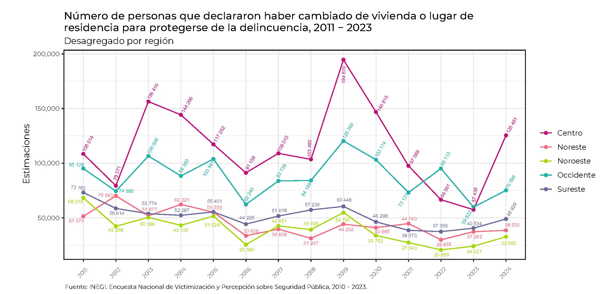
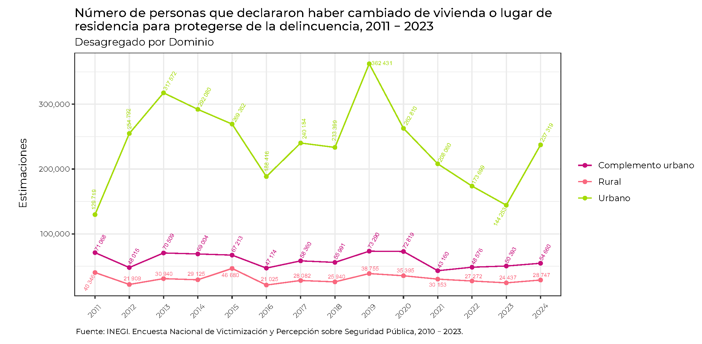
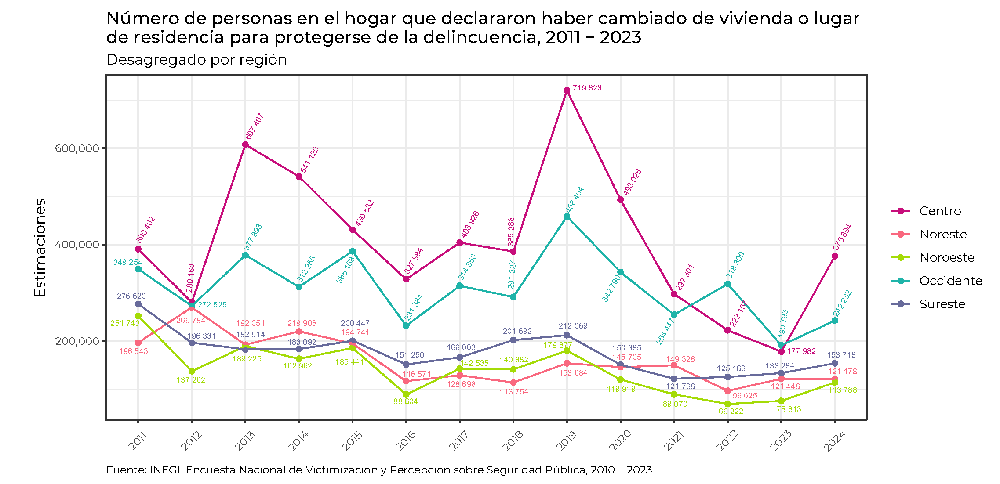
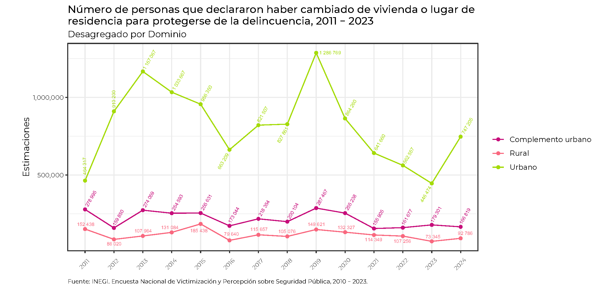

\usepackage{color}

```{=html}
<style>
code.r{
  font-size: 10px;
}
pre {
  font-size: 12px
}
</style>

<style>
body {
text-align: justify;
font-style: normal;
font-family: "Montserrat";
font-size: 12px
}
h1.title {
  font-size: 40px;
  color: #000D3B;
}
h1 {
  color: #B6854D;
}
h2 {
  color: #172984;
}
h3 {
  color: #172984;
}
</style>
```

```{=html}
<style>
.nav>li>a {
    position: relative;
    display: block;
    padding: 10px 15px;
    color: #0A2687;
}
.nav-pills>li.active>a, .nav-pills > li.active > a:hover, .nav-pills > li.active > a:focus {
    color: #ffffff;
    background-color: #09C2BC;
}
.top1-tiles a:nth-of-type(1):hover, .top-tiles1 a:nth-of-type(1):focus{
    color: #ffffff;
    background: #0A6A87
}
.top2-tiles a:nth-of-type(1):hover, .top2-tiles a:nth-of-type(1):focus{
    color: #ffffff;
    background: #0A6CC8.m 
}
.top3-tiles a:nth-of-type(1):hover, .top2-tiles a:nth-of-type(1):focus{
    color: #ffffff;
    background: #596AB7
}
</style>
```

```{r, include=FALSE}
knitr::opts_chunk$set(echo = TRUE, message = FALSE, warning = FALSE, cache = FALSE, cache.lazy = FALSE, 
                         eval = TRUE, class.source = "fold-show")
knitr::opts_knit$set(root.dir = rprojroot::find_rstudio_root_file())
options(digits = 2, encoding = "UTF8")
```

```{r, echo=FALSE}
rm(list = ls())
```

```{r, echo=FALSE}
setwd(here::here())
```

```{r, echo=FALSE, results = FALSE, message= FALSE, warning= FALSE}
#Font Stlye
require(showtext)
library(extrafont)
# activar showtext
#ttf_import('../AppData/Local/Microsoft/Windows/Fonts/')
windowsFonts()
```

```{r, echo = FALSE}
require(readxl)
require(dplyr)
require(gt)
require(ggplot2)
require(ggpubr)
require(ggrepel)
require(knitr)
require(kableExtra)
```

La Encuesta Nacional de Victimización y Percepción sobre Seguridad Pública [(`ENVIPE`)](https://www.inegi.org.mx/programas/envipe/2024/) es un instrumento estadístico diseñado por el Instituto Nacional de Estadística y Geografía [(`INEGI`)](https://www.inegi.org.mx/default.html) en México. Su objetivo principal es generar información sobre la magnitud y características de la victimización en el país, así como evaluar la percepción de los ciudadanos sobre la seguridad pública y el desempeño de las instituciones encargadas de la justicia y la seguridad.

La importancia de la ENVIPE:

-   Planeación y diseño de políticas públicas: Proporciona datos fundamentales para que los gobiernos federal, estatal y municipal diseñen estrategias de prevención del delito.

-   Evaluación del sistema de justicia: Permite identificar áreas de oportunidad en las instituciones encargadas de la seguridad pública y la justicia.

-   Información para académicos y sociedad civil: Los datos son utilizados en investigaciones y análisis independientes que buscan mejorar el entendimiento del fenómeno delictivo en México.

## Características

El propósito de la ENVIPE es proporcionar datos representativos y confiables para entender:

-   **La prevalencia delictiva**: Cuántas personas han sido víctimas de delitos en el último año.

-   **El impacto de la delincuencia**: Analizar las consecuencias económicas, sociales y psicológicas de los delitos.

-   **La percepción de seguridad**: Evaluar cómo las personas perciben su entorno en términos de seguridad, a nivel local, estatal y nacional.

-   **La confianza en las autoridades**: Medir la opinión pública sobre las instituciones de seguridad pública, justicia y procuración de justicia.

-   **La cifra negra:** Identificar los delitos que no son denunciados o que, aunque son denunciados, no se investigan, revelando el nivel de subregistro.

## Tipo de información

La encuesta recoge información sobre:

-   **Características sociodemográficas de los hogares y las personas**: Edad, sexo, nivel educativo, ocupación, entre otros.

-   **Victimización:**

    -   Delitos más comunes (robos, fraudes, extorsiones, etc.).

    -   Lugares y momentos en que ocurren.

    -   Medios utilizados por los delincuentes.

    -   Perfiles de las víctimas.

-   **Costos del delito**: Incluye pérdidas materiales, costos emocionales y gastos relacionados con medidas preventivas.

-   **Percepción de inseguridad:**

    -   Opinión sobre la seguridad en espacios públicos como calles, parques, mercados y transporte público.

    -   Sensación de inseguridad a nivel estatal y nacional.

-   **Confianza y desempeño de las instituciones**:

    -   Opinión sobre la policía, el Ministerio Público, el ejército, la Guardia Nacional, entre otros.

    -   Niveles de denuncia y razones para no denunciar (desconfianza, trámites complicados, etc.).

-   **Medidas de autoprotección**: Acciones que los ciudadanos toman para evitar ser víctimas de delitos. 

## Diseño muestral   


**Bases de datos**

## Personas

AP4_11_10 4.11 Durante 2023, para protegerse de la delincuencia, ¿en este hogar se realizó algún tipo de medida como… cambiarse de vivienda o lugar de residencia?

```{r}
Personas <- read_xlsx(paste0(here::here(), "/Bases/MC_ENVIPE 2011 - 2024.xlsx"), 
                      sheet = "Promedios", 
                      range = "C5:L19",
                      col_names = TRUE)
```

::: {style="height:330px; overflow:auto;"}
```{r, echo = FALSE}
require(gt)

Personas %>% 
 gt() %>%
  tab_header(title = "Durante 2023, para protegerse de la delincuencia, ¿en este hogar se realizó algún tipo de medida como… cambiarse de vivienda o lugar de residencia?",
             subtitle = "Total de personas que cambiaron de vivienda o lugar de residencia") %>%
   fmt_integer(columns = names(Personas)[2:7], 
               sep_mark = " ") %>%
    fmt_number(columns = names(Personas)[8:10], 
                decimals = 4) %>%
     tab_options(heading.title.font.size = 14, 
                 heading.subtitle.font.size = 12,
                 table.font.names = "Century Gothic",
                 table.font.size = 10,
                 table.align = 'center',
                 data_row.padding = px(1)) %>%
      tab_style(style = list(cell_text(align = "left", 
                                       weight = 'bold')),
                locations = list(cells_title(groups = c("title")))) %>%
      tab_style(style = list(cell_text(align = "left")),
                locations = list(cells_title(groups = c("subtitle")))) %>%
      tab_style(style = "vertical-align:middle; font-weight: bold",
                locations = cells_column_labels()) %>%
       cols_label(
                  Est = md("**Estimación**"),
                  CI = "CI (5%)",
                  CS = "CS (95%)",
                  P.2años = "Promedio (2 años)",
                  P.3años = "Promedio (3 años)",
                  P.4años = "Promedio (4 años)",
                  Var.2años = "Variación (2 años)",
                  Var.3años = "Variación (3 años)",
                  Var.4años = "Variación (4 años)",
                ) %>%
       tab_footnote(footnote = "Fuente: INEGI. Encuesta Nacional de Victimización y Percepción sobre Seguridad Pública, 2010 - 2023.") %>%
        as_raw_html() 
```
:::

### Comparativos a nivel Nacional {.tabset .tabset-pills}

#### Promedio de 2 años

```{r, eval = FALSE, class.source = "fold-hide"}
p <- Personas %>% 
      ggplot(aes(x = Año, y = Est)) + 
       geom_point(aes(color = "LINE1")) + 
        geom_line(aes(color = "LINE1")) + 
        geom_ribbon(aes(ymin = CI, ymax = CS), 
                    linetype = 2, 
                    alpha = 0.1) + 
        geom_text_repel(aes(label = format(Est, big.mark = " ")),
                        position = position_jitter(seed = 123),
                        size = 2,
                        color = "#900C3F",
                        angle = 45, 
                        force = 0.7,
                        segment.linetype = 1,
                        direction = c("both"),
                        family = "Montserrat",
                          max.overlaps = 2) + 
         ## Promedio de 2 años 
          geom_point(aes(x = Año - 0.5, y = P.2años, color = "LINE2")) + 
          geom_line(aes(x = Año - 0.5, y = P.2años, color = "LINE2")) + 
          geom_text_repel(aes(x = Año - 0.5, y = P.2años, label = format(P.2años, big.mark = " ")),
                          position = position_jitter(seed = 123),
                          size = 2,
                          color = "#194c65",
                          angle = 45, 
                          force = 0.7,
                          segment.linetype = 1,
                          direction = c("both"),
                          family = "Montserrat",
                          max.overlaps = 2) +
           ## Variaciones
           geom_text(aes(x = Año - 0.5, 
                         y = 150000, 
                         label = format(Variaciones, digits = 2, nsmall = 1),
                         color = "LINE3"),
                     size = 2.5,
                     vjust = 1,
                     fontface = "bold",
                     angle = 90, 
                     family = "Montserrat"
                       ) +
           theme_bw() + 
            theme(text = element_text(family = "Montserrat"),
                  axis.text.y = element_text(size = 8),
                  axis.text.x = element_text(size = 6, angle = 45, vjust = 0),
                  plot.caption = element_text(size = 7, hjust = 0, vjust = -1.5, family = "Montserrat"),
            ) +
             scale_y_continuous(labels = scales::comma) +
             scale_x_discrete(limits = seq(2011, 2024, 1)) +
             scale_color_manual(labels = c("Estimaciones",
                                           "Promedio (2 años)",
                                           "Variaciones"),
                                values = c("LINE1" = "#900C3F",
                                           "LINE2" = "#48b6ec",
                                           "LINE3" = "#1f42c1")
                                ) + 
             labs(title = stringr::str_wrap("Número de personas que declararon haber cambiado de vivienda o lugar de residencia para protegerse de la delincuencia, 2011 - 2023", 80),
                  subtitle = "Comparativo con el promedio de 2 años",
                  x = "",
                  y = "Estimaciones",
                  color = "",
                  caption = expression(paste("Fuente: INEGI. Encuesta Nacional de Victimización y Percepción sobre Seguridad Pública, 2010 - 2023.")))

p

path = paste0(here::here(),"/Output/ENVIPE_Comparativo de 2 años.pdf")
ggexport(list = p, width = 10, height = 5, dpi = 400, filename = path)
```


#### Promedio de 3 años

```{r, eval = FALSE, class.source = "fold-hide"}
p <- Personas %>% 
      ggplot(aes(x = Año, y = Est)) + 
       geom_point(aes(color = "LINE1")) + 
        geom_line(aes(color = "LINE1")) + 
        geom_ribbon(aes(ymin = CI, ymax = CS), 
                    linetype = 2, 
                    alpha = 0.1) + 
        geom_text_repel(aes(label = format(Est, big.mark = " ")),
                        position = position_jitter(seed = 123),
                        size = 2,
                        color = "#900C3F",
                        angle = 45, 
                        force = 0.7,
                        segment.linetype = 1,
                        direction = c("both"),
                        family = "Montserrat",
                          max.overlaps = 2) + 
         ## Promedio de 2 años 
          geom_point(aes(x = Año - 1, y = P.3años, color = "LINE2")) + 
          geom_line(aes(x = Año - 1, y = P.3años, color = "LINE2")) + 
          geom_text_repel(aes(x = Año - 1, y = P.3años, label = format(P.3años, big.mark = " ")),
                          position = position_jitter(seed = 123),
                          size = 2,
                          color = "#7e33b8",
                          angle = 45, 
                          force = 0.7,
                          segment.linetype = 1,
                          direction = c("both"),
                          family = "Montserrat",
                          max.overlaps = 2) +
           ## Variaciones
           geom_text(data = Personas %>% slice(3:14),
                     aes(x = Año - 1, 
                         y = 150000, 
                         label = format(Var.3años, digits = 2, nsmall = 1),
                         color = "LINE3"),
                     size = 2.5,
                     vjust = 1,
                     fontface = "bold",
                     angle = 90, 
                     family = "Montserrat"
                       ) +
           theme_bw() + 
            theme(text = element_text(family = "Montserrat"),
                  axis.text.y = element_text(size = 8),
                  axis.text.x = element_text(size = 6, angle = 45, vjust = 0),
                  plot.caption = element_text(size = 7, hjust = 0, vjust = -1.5, family = "Montserrat"),
            ) +
             scale_y_continuous(labels = scales::comma) +
             scale_x_discrete(limits = seq(2011, 2024, 1)) +
             scale_color_manual(labels = c("Estimaciones",
                                           "Promedio (3 años)",
                                           "Variaciones"),
                                values = c("LINE1" = "#900C3F",
                                           "LINE2" = "#3a0d5c",
                                           "LINE3" = "#52306c")
                                ) + 
             labs(title = stringr::str_wrap("Número de personas que declararon haber cambiado de vivienda o lugar de residencia para protegerse de la delincuencia, 2011 - 2023", 80),
                  subtitle = "Comparativo con el promedio de 3 años",
                  x = "",
                  y = "Estimaciones",
                  color = "",
                  caption = expression(paste("Fuente: INEGI. Encuesta Nacional de Victimización y Percepción sobre Seguridad Pública, 2010 - 2023.")))

p

path = paste0(here::here(),"/Output/ENVIPE_Comparativo de 3 años.pdf")
ggexport(list = p, width = 10, height = 5, dpi = 400, filename = path)
```


#### Promedio de 4 años

```{r, eval = FALSE, class.source = "fold-hide"}
p <- Personas %>% 
      ggplot(aes(x = Año, y = Est)) + 
       geom_point(aes(color = "LINE1")) + 
        geom_line(aes(color = "LINE1")) + 
        geom_ribbon(aes(ymin = CI, ymax = CS), 
                    linetype = 2, 
                    alpha = 0.1) + 
        geom_text_repel(aes(label = format(Est, big.mark = " ")),
                        position = position_jitter(seed = 123),
                        size = 2,
                        color = "#900C3F",
                        angle = 45, 
                        force = 0.7,
                        segment.linetype = 1,
                        direction = c("both"),
                        family = "Montserrat",
                          max.overlaps = 2) + 
         ## Promedio de 2 años 
          geom_point(aes(x = Año - 1, y = P.4años, color = "LINE2")) + 
          geom_line(aes(x = Año - 1, y = P.4años, color = "LINE2")) + 
          geom_text_repel(aes(x = Año - 1, y = P.4años, label = format(P.4años, big.mark = " ")),
                          position = position_jitter(seed = 123),
                          size = 2,
                          color = "#02360d",
                          angle = 45, 
                          force = 0.7,
                          segment.linetype = 1,
                          direction = c("both"),
                          family = "Montserrat",
                          max.overlaps = 2) +
           ## Variaciones
           geom_text(data = Personas %>% slice(4:14),
                     aes(x = Año - 1, 
                         y = 150000, 
                         label = format(Var.4años, digits = 2, nsmall = 1),
                         color = "LINE3"),
                     size = 2.5,
                     vjust = 1,
                     fontface = "bold",
                     angle = 90, 
                     family = "Montserrat"
                       ) +
           theme_bw() + 
            theme(text = element_text(family = "Montserrat"),
                  axis.text.y = element_text(size = 8),
                  axis.text.x = element_text(size = 6, angle = 45, vjust = 0),
                  plot.caption = element_text(size = 7, hjust = 0, vjust = -1.5, family = "Montserrat"),
            ) +
             scale_y_continuous(labels = scales::comma) +
             scale_x_discrete(limits = seq(2011, 2024, 1)) +
             scale_color_manual(labels = c("Estimaciones",
                                           "Promedio (4 años)",
                                           "Variaciones"),
                                values = c("LINE1" = "#900C3F",
                                           "LINE2" = "#2cb141",
                                           "LINE3" = "#146157")
                                ) + 
             labs(title = stringr::str_wrap("Número de personas que declararon haber cambiado de vivienda o lugar de residencia para protegerse de la delincuencia, 2011 - 2023", 80),
                  subtitle = "Comparativo con el promedio de 4 años",
                  x = "",
                  y = "Estimaciones",
                  color = "",
                  caption = expression(paste("Fuente: INEGI. Encuesta Nacional de Victimización y Percepción sobre Seguridad Pública, 2010 - 2023.")))

p

path = paste0(here::here(),"/Output/ENVIPE_Comparativo de 4 años.pdf")
ggexport(list = p, width = 10, height = 5, dpi = 400, filename = path)
```


### Comparativos a nivel Regional {.tabset .tabset-pills}

```{r}
Region <- read_xlsx(paste0(here::here(), "/Bases/MC_ENVIPE 2011 - 2024.xlsx"), 
                    sheet = "Tablas", 
                    range = "C39:Q45",
                    col_names = TRUE)
```

```{r, eval = FALSE, class.source = "fold-hide"}
require(reshape2)
require(Hmisc)

tabla <- Region %>%
          melt() %>% 
           filter(Región %nin% "Total") 

p <- tabla %>%
      ggplot(aes(x = variable, y = value)) +
       geom_point(aes(color = Región)) + 
        geom_line(aes(color = Región, group = Región)) + 
         geom_text(data = tabla,
                   aes(x = variable, 
                       y = value, 
                       label = format(value, big.mark = " "),
                       color = Región, 
                       group = Región),
                   size = 2,
                   angle = 60
                   ) +
           theme_bw() + 
            theme(text = element_text(family = "Montserrat"),
                  axis.text.y = element_text(size = 8),
                  axis.text.x = element_text(size = 6, angle = 45, vjust = 0),
                  plot.caption = element_text(size = 7, hjust = 0, vjust = -1.5, family = "Montserrat"),
            ) +
             scale_y_continuous(labels = scales::comma) +
             scale_color_manual(values = colorRampPalette(LaCroixColoR::lacroix_palette("PassionFruit", n = 50, type = "continuous"))(6)
                                ) + 
             labs(title = stringr::str_wrap("Número de personas que declararon haber cambiado de vivienda o lugar de residencia para protegerse de la delincuencia, 2011 - 2023", 80),
                  subtitle = "Desagregado por región",
                  x = "",
                  y = "Estimaciones",
                  color = "",
                  caption = expression(paste("Fuente: INEGI. Encuesta Nacional de Victimización y Percepción sobre Seguridad Pública, 2010 - 2023.")))

p

path = paste0(here::here(),"/Output/ENVIPE_Region.pdf")
ggexport(list = p, width = 10, height = 5, dpi = 400, filename = path)
```



### Comparativos a nivel Dominio {.tabset .tabset-pills}

```{r}
Dominio <- read_xlsx(paste0(here::here(), "/Bases/MC_ENVIPE 2011 - 2024.xlsx"), 
                     sheet = "Tablas", 
                     range = "C47:Q51",
                     col_names = TRUE)
```

```{r, eval = FALSE, class.source = "fold-hide"}
require(reshape2)
require(Hmisc)

tabla <- Dominio %>%
          melt() %>% 
           filter(Dominio %nin% "Total") 

p <- tabla %>%
      ggplot(aes(x = variable, y = value)) +
       geom_point(aes(color = Dominio)) + 
        geom_line(aes(color = Dominio, group = Dominio)) + 
         geom_text(data = tabla,
                   aes(x = variable, 
                       y = value, 
                       label = format(value, big.mark = " "),
                       color = Dominio, 
                       group = Dominio),
                   size = 2,
                   angle = 60
                   ) +
           theme_bw() + 
            theme(text = element_text(family = "Montserrat"),
                  axis.text.y = element_text(size = 8),
                  axis.text.x = element_text(size = 6, angle = 45, vjust = 0),
                  plot.caption = element_text(size = 7, hjust = 0, vjust = -1.5, family = "Montserrat"),
            ) +
             scale_y_continuous(labels = scales::comma) +
             scale_color_manual(values = colorRampPalette(LaCroixColoR::lacroix_palette("PassionFruit", n = 50, type = "continuous"))(6)
                                ) + 
             labs(title = stringr::str_wrap("Número de personas que declararon haber cambiado de vivienda o lugar de residencia para protegerse de la delincuencia, 2011 - 2023", 80),
                  subtitle = "Desagregado por Dominio",
                  x = "",
                  y = "Estimaciones",
                  color = "",
                  caption = expression(paste("Fuente: INEGI. Encuesta Nacional de Victimización y Percepción sobre Seguridad Pública, 2010 - 2023.")))

p

path = paste0(here::here(),"/Output/ENVIPE_Dominio.pdf")
ggexport(list = p, width = 10, height = 5, dpi = 400, filename = path)
```



## Hogares

AP4_11_10 4.11 Durante 2023, para protegerse de la delincuencia, ¿en este hogar se realizó algún tipo de medida como… cambiarse de vivienda o lugar de residencia?

```{r}
Hogares <- read_xlsx(paste0(here::here(), "/Bases/MC_ENVIPE 2011 - 2024.xlsx"), 
                     sheet = "Promedios", 
                     range = "N5:W19",
                     col_names = TRUE)
```

::: {style="height:330px; overflow:auto;"}
```{r, echo = FALSE}
require(gt)

Hogares %>% 
 gt() %>%
  tab_header(title = "Durante 2023, para protegerse de la delincuencia, ¿en este hogar se realizó algún tipo de medida como… cambiarse de vivienda o lugar de residencia?",
             subtitle = "Total de personas en los hogares que cambiaron de vivienda o lugar de residencia") %>%
   fmt_integer(columns = names(Personas)[2:7], 
               sep_mark = " ") %>%
    fmt_number(columns = names(Personas)[8:10], 
                decimals = 4) %>%
     tab_options(heading.title.font.size = 14, 
                 heading.subtitle.font.size = 12,
                 table.font.names = "Century Gothic",
                 table.font.size = 10,
                 table.align = 'center',
                 data_row.padding = px(1)) %>%
      tab_style(style = list(cell_text(align = "left", 
                                       weight = 'bold')),
                locations = list(cells_title(groups = c("title")))) %>%
      tab_style(style = list(cell_text(align = "left")),
                locations = list(cells_title(groups = c("subtitle")))) %>%
      tab_style(style = "vertical-align:middle; font-weight: bold",
                locations = cells_column_labels()) %>%
       cols_label(
                  Est = md("**Estimación**"),
                  CI = "CI (5%)",
                  CS = "CS (95%)",
                  P.2años = "Promedio (2 años)",
                  P.3años = "Promedio (3 años)",
                  P.4años = "Promedio (4 años)",
                  Var.2años = "Variación (2 años)",
                  Var.3años = "Variación (3 años)",
                  Var.4años = "Variación (4 años)",
                ) %>%
       tab_footnote(footnote = "Fuente: INEGI. Encuesta Nacional de Victimización y Percepción sobre Seguridad Pública, 2010 - 2023.") %>%
        as_raw_html() 
```
:::

### Comparativos a nivel Nacional {.tabset .tabset-pills}

#### Promedio de 2 años

```{r, eval = FALSE, class.source = "fold-hide"}
p <- Hogares %>% 
      ggplot(aes(x = Año, y = Est)) + 
       geom_point(aes(color = "LINE1")) + 
        geom_line(aes(color = "LINE1")) + 
        geom_ribbon(aes(ymin = CI, ymax = CS), 
                    linetype = 2, 
                    alpha = 0.1) + 
        geom_text_repel(aes(label = format(Est, big.mark = " ")),
                        position = position_jitter(seed = 123),
                        size = 2,
                        color = "#900C3F",
                        angle = 45, 
                        force = 0.7,
                        segment.linetype = 1,
                        direction = c("both"),
                        family = "Montserrat",
                          max.overlaps = 2) + 
         ## Promedio de 2 años 
          geom_point(aes(x = Año - 0.5, y = P.2años, color = "LINE2")) + 
          geom_line(aes(x = Año - 0.5, y = P.2años, color = "LINE2")) + 
          geom_text_repel(aes(x = Año - 0.5, y = P.2años, label = format(P.2años, big.mark = " ")),
                          position = position_jitter(seed = 123),
                          size = 2,
                          color = "#194c65",
                          angle = 45, 
                          force = 0.7,
                          segment.linetype = 1,
                          direction = c("both"),
                          family = "Montserrat",
                          max.overlaps = 2) +
           ## Variaciones
           geom_text(aes(x = Año - 0.5, 
                         y = 450000, 
                         label = format(Var.2años, digits = 2, nsmall = 1),
                         color = "LINE3"),
                     size = 2.5,
                     vjust = 1,
                     fontface = "bold",
                     angle = 90, 
                     family = "Montserrat"
                       ) +
           theme_bw() + 
            theme(text = element_text(family = "Montserrat"),
                  axis.text.y = element_text(size = 8),
                  axis.text.x = element_text(size = 6, angle = 45, vjust = 0),
                  plot.caption = element_text(size = 7, hjust = 0, vjust = -1.5, family = "Montserrat"),
            ) +
             scale_y_continuous(labels = scales::comma) +
             scale_x_discrete(limits = seq(2011, 2024, 1)) +
             scale_color_manual(labels = c("Estimaciones",
                                           "Promedio (2 años)",
                                           "Variaciones"),
                                values = c("LINE1" = "#900C3F",
                                           "LINE2" = "#48b6ec",
                                           "LINE3" = "#1f42c1")
                                ) + 
             labs(title = stringr::str_wrap("Número de personas en el hogar que declararon haber cambiado de vivienda o lugar de residencia para protegerse de la delincuencia, 2011 - 2023", 80),
                  subtitle = "Comparativo con el promedio de 2 años",
                  x = "",
                  y = "Estimaciones",
                  color = "",
                  caption = expression(paste("Fuente: INEGI. Encuesta Nacional de Victimización y Percepción sobre Seguridad Pública, 2010 - 2023.")))

p

path = paste0(here::here(),"/Output/ENVIPE_Comparativo de 2 años_Hogar.pdf")
ggexport(list = p, width = 10, height = 5, dpi = 400, filename = path)
```


#### Promedio de 3 años

```{r, eval = FALSE, class.source = "fold-hide"}
p <- Hogares %>% 
      ggplot(aes(x = Año, y = Est)) + 
       geom_point(aes(color = "LINE1")) + 
        geom_line(aes(color = "LINE1")) + 
        geom_ribbon(aes(ymin = CI, ymax = CS), 
                    linetype = 2, 
                    alpha = 0.1) + 
        geom_text_repel(aes(label = format(Est, big.mark = " ")),
                        position = position_jitter(seed = 123),
                        size = 2,
                        color = "#900C3F",
                        angle = 45, 
                        force = 0.7,
                        segment.linetype = 1,
                        direction = c("both"),
                        family = "Montserrat",
                          max.overlaps = 2) + 
         ## Promedio de 2 años 
          geom_point(aes(x = Año - 1, y = P.3años, color = "LINE2")) + 
          geom_line(aes(x = Año - 1, y = P.3años, color = "LINE2")) + 
          geom_text_repel(aes(x = Año - 1, y = P.3años, label = format(P.3años, big.mark = " ")),
                          position = position_jitter(seed = 123),
                          size = 2,
                          color = "#7e33b8",
                          angle = 45, 
                          force = 0.7,
                          segment.linetype = 1,
                          direction = c("both"),
                          family = "Montserrat",
                          max.overlaps = 2) +
           ## Variaciones
           geom_text(data = Personas %>% slice(3:14),
                     aes(x = Año - 1, 
                         y = 450000, 
                         label = format(Var.3años, digits = 2, nsmall = 1),
                         color = "LINE3"),
                     size = 2.5,
                     vjust = 1,
                     fontface = "bold",
                     angle = 90, 
                     family = "Montserrat"
                       ) +
           theme_bw() + 
            theme(text = element_text(family = "Montserrat"),
                  axis.text.y = element_text(size = 8),
                  axis.text.x = element_text(size = 6, angle = 45, vjust = 0),
                  plot.caption = element_text(size = 7, hjust = 0, vjust = -1.5, family = "Montserrat"),
            ) +
             scale_y_continuous(labels = scales::comma) +
             scale_x_discrete(limits = seq(2011, 2024, 1)) +
             scale_color_manual(labels = c("Estimaciones",
                                           "Promedio (3 años)",
                                           "Variaciones"),
                                values = c("LINE1" = "#900C3F",
                                           "LINE2" = "#3a0d5c",
                                           "LINE3" = "#52306c")
                                ) + 
             labs(title = stringr::str_wrap("Número de personas en el hogar que declararon haber cambiado de vivienda o lugar de residencia para protegerse de la delincuencia, 2011 - 2023", 80),
                  subtitle = "Comparativo con el promedio de 3 años",
                  x = "",
                  y = "Estimaciones",
                  color = "",
                  caption = expression(paste("Fuente: INEGI. Encuesta Nacional de Victimización y Percepción sobre Seguridad Pública, 2010 - 2023.")))

p

path = paste0(here::here(),"/Output/ENVIPE_Comparativo de 3 años_Hogar.pdf")
ggexport(list = p, width = 10, height = 5, dpi = 400, filename = path)
```


#### Promedio de 4 años

```{r, eval = FALSE, class.source = "fold-hide"}
p <- Hogares %>% 
      ggplot(aes(x = Año, y = Est)) + 
       geom_point(aes(color = "LINE1")) + 
        geom_line(aes(color = "LINE1")) + 
        geom_ribbon(aes(ymin = CI, ymax = CS), 
                    linetype = 2, 
                    alpha = 0.1) + 
        geom_text_repel(aes(label = format(Est, big.mark = " ")),
                        position = position_jitter(seed = 123),
                        size = 2,
                        color = "#900C3F",
                        angle = 45, 
                        force = 0.7,
                        segment.linetype = 1,
                        direction = c("both"),
                        family = "Montserrat",
                          max.overlaps = 2) + 
         ## Promedio de 2 años 
          geom_point(aes(x = Año - 1, y = P.4años, color = "LINE2")) + 
          geom_line(aes(x = Año - 1, y = P.4años, color = "LINE2")) + 
          geom_text_repel(aes(x = Año - 1, y = P.4años, label = format(P.4años, big.mark = " ")),
                          position = position_jitter(seed = 123),
                          size = 2,
                          color = "#02360d",
                          angle = 45, 
                          force = 0.7,
                          segment.linetype = 1,
                          direction = c("both"),
                          family = "Montserrat",
                          max.overlaps = 2) +
           ## Variaciones
           geom_text(data = Personas %>% slice(4:14),
                     aes(x = Año - 1, 
                         y = 450000, 
                         label = format(Var.4años, digits = 2, nsmall = 1),
                         color = "LINE3"),
                     size = 2.5,
                     vjust = 1,
                     fontface = "bold",
                     angle = 90, 
                     family = "Montserrat"
                       ) +
           theme_bw() + 
            theme(text = element_text(family = "Montserrat"),
                  axis.text.y = element_text(size = 8),
                  axis.text.x = element_text(size = 6, angle = 45, vjust = 0),
                  plot.caption = element_text(size = 7, hjust = 0, vjust = -1.5, family = "Montserrat"),
            ) +
             scale_y_continuous(labels = scales::comma) +
             scale_x_discrete(limits = seq(2011, 2024, 1)) +
             scale_color_manual(labels = c("Estimaciones",
                                           "Promedio (4 años)",
                                           "Variaciones"),
                                values = c("LINE1" = "#900C3F",
                                           "LINE2" = "#2cb141",
                                           "LINE3" = "#146157")
                                ) + 
             labs(title = stringr::str_wrap("Número de personas en el hogar que declararon haber cambiado de vivienda o lugar de residencia para protegerse de la delincuencia, 2011 - 2023", 80),
                  subtitle = "Comparativo con el promedio de 4 años",
                  x = "",
                  y = "Estimaciones",
                  color = "",
                  caption = expression(paste("Fuente: INEGI. Encuesta Nacional de Victimización y Percepción sobre Seguridad Pública, 2010 - 2023.")))

p

path = paste0(here::here(),"/Output/ENVIPE_Comparativo de 4 años_Hogar.pdf")
ggexport(list = p, width = 10, height = 5, dpi = 400, filename = path)
```


### Comparativos a nivel Regional {.tabset .tabset-pills}

```{r}
Region_Hogar <- read_xlsx(paste0(here::here(), "/Bases/MC_ENVIPE 2011 - 2024.xlsx"), 
                          sheet = "Tablas", 
                          range = "T39:AH45",
                          col_names = TRUE)
```

```{r, eval = FALSE, class.source = "fold-hide"}
require(reshape2)
require(Hmisc)

tabla <- Region_Hogar %>%
          melt() %>% 
           filter(Región %nin% "Total") 

p <- tabla %>%
      ggplot(aes(x = variable, y = value)) +
       geom_point(aes(color = Región)) + 
        geom_line(aes(color = Región, group = Región)) + 
         geom_text(data = tabla,
                   aes(x = variable, 
                       y = value, 
                       label = format(value, big.mark = " "),
                       color = Región, 
                       group = Región),
                   size = 2,
                   angle = 60
                   ) +
           theme_bw() + 
            theme(text = element_text(family = "Montserrat"),
                  axis.text.y = element_text(size = 8),
                  axis.text.x = element_text(size = 6, angle = 45, vjust = 0),
                  plot.caption = element_text(size = 7, hjust = 0, vjust = -1.5, family = "Montserrat"),
            ) +
             scale_y_continuous(labels = scales::comma) +
             scale_color_manual(values = colorRampPalette(LaCroixColoR::lacroix_palette("PassionFruit", n = 50, type = "continuous"))(6)
                                ) + 
             labs(title = stringr::str_wrap("Número de personas en el hogar que declararon haber cambiado de vivienda o lugar de residencia para protegerse de la delincuencia, 2011 - 2023", 80),
                  subtitle = "Desagregado por región",
                  x = "",
                  y = "Estimaciones",
                  color = "",
                  caption = expression(paste("Fuente: INEGI. Encuesta Nacional de Victimización y Percepción sobre Seguridad Pública, 2010 - 2023.")))

p

path = paste0(here::here(),"/Output/ENVIPE_Region_Hogar.pdf")
ggexport(list = p, width = 10, height = 5, dpi = 400, filename = path)
```



### Comparativos a nivel Dominio {.tabset .tabset-pills}

```{r}
Dominio_Hogar <- read_xlsx(paste0(here::here(), "/Bases/MC_ENVIPE 2011 - 2024.xlsx"), 
                           sheet = "Tablas", 
                           range = "T47:AH51",
                           col_names = TRUE)
```

```{r, eval = FALSE, class.source = "fold-hide"}
require(reshape2)
require(Hmisc)

tabla <- Dominio_Hogar %>%
          melt() %>% 
           filter(Dominio %nin% "Total") 

p <- tabla %>%
      ggplot(aes(x = variable, y = value)) +
       geom_point(aes(color = Dominio)) + 
        geom_line(aes(color = Dominio, group = Dominio)) + 
         geom_text(data = tabla,
                   aes(x = variable, 
                       y = value, 
                       label = format(value, big.mark = " "),
                       color = Dominio, 
                       group = Dominio),
                   size = 2,
                   angle = 60
                   ) +
           theme_bw() + 
            theme(text = element_text(family = "Montserrat"),
                  axis.text.y = element_text(size = 8),
                  axis.text.x = element_text(size = 6, angle = 45, vjust = 0),
                  plot.caption = element_text(size = 7, hjust = 0, vjust = -1.5, family = "Montserrat"),
            ) +
             scale_y_continuous(labels = scales::comma) +
             scale_color_manual(values = colorRampPalette(LaCroixColoR::lacroix_palette("PassionFruit", n = 50, type = "continuous"))(6)
                                ) + 
             labs(title = stringr::str_wrap("Número de personas que declararon haber cambiado de vivienda o lugar de residencia para protegerse de la delincuencia, 2011 - 2023", 80),
                  subtitle = "Desagregado por Dominio",
                  x = "",
                  y = "Estimaciones",
                  color = "",
                  caption = expression(paste("Fuente: INEGI. Encuesta Nacional de Victimización y Percepción sobre Seguridad Pública, 2010 - 2023.")))

p

path = paste0(here::here(),"/Output/ENVIPE_Dominio_Hogar.pdf")
ggexport(list = p, width = 10, height = 5, dpi = 400, filename = path)
```



```{r, collapse=FALSE}
sesion_info <- devtools::session_info()
```

```{r, echo = FALSE}
kable(dplyr::select(tibble::as_tibble(sesion_info$packages %>% dplyr::filter(attached == TRUE)),
                    c(package, loadedversion, source))) %>%
   kable_classic(full_width = TRUE, html_font = "montserrat", font_size = 10) 
```

<a rel="license" href="http://creativecommons.org/licenses/by/4.0/"></a><br />This work by [**Diana Villasana Ocampo**]{xmlns:cc="http://creativecommons.org/ns#" property="cc:attributionName"} is licensed under a <a rel="license" href="http://creativecommons.org/licenses/by/4.0/">Creative Commons Attribution 4.0 International License</a>.
